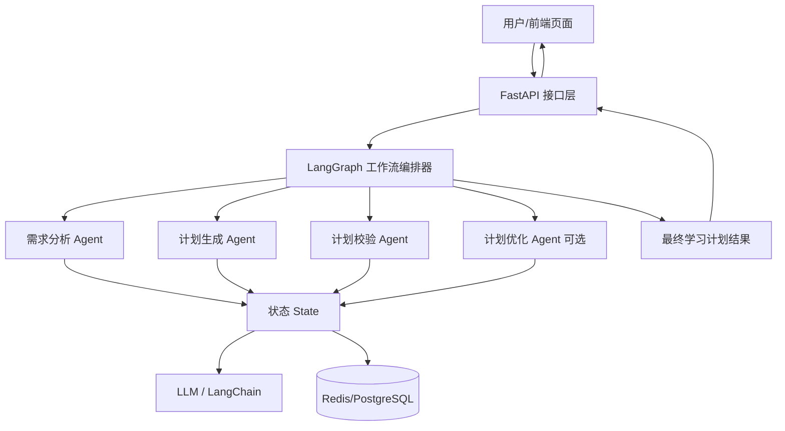
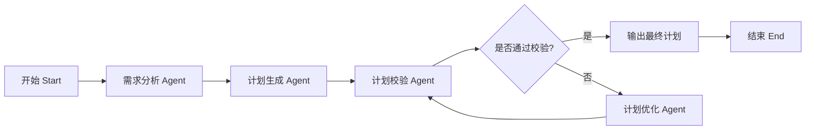

# 基于 LangGraph 的多智能体学习计划生成系统

## 一、系统设计说明

## 1. 项目目标

构建一个面向 **考试备考、技能提升、长期学习规划** 的学习计划生成系统。  
系统接收用户的学习目标、当前水平、剩余时间、每日可投入时长等信息，自动生成 **分阶段、可执行、个性化** 的学习计划，并支持计划校验与调整。

### 设计目标
1. 能根据用户画像自动拆解学习目标。
2. 能生成按阶段划分的学习任务安排。
3. 能校验计划的合理性，避免目标过满或时间冲突。
4. 能通过 FastAPI 对外提供接口，便于后续扩展为 Web/小程序/学习助手应用。

---

## 2. Demo 范围

### 输入
用户提交以下信息：
- 学习目标：如考研英语 80 分、3 个月通过雅思、2 个月掌握 Python 基础
- 学习类型：考试备考 / 技能提升 / 长期规划
- 当前水平：初级 / 中级 / 高级，或更细粒度描述
- 学习周期：开始时间、结束时间
- 每日可投入时长：如 2 小时/天
- 特殊约束：工作日忙、周末可多学、偏弱科目、是否需要复习周期等

### 输出
系统生成：
- 总体学习规划
- 阶段划分结果
- 每阶段目标与重点内容
- 每周/每日建议任务
- 风险提示与优化建议

---

## 3. 总体架构设计

系统采用 **分层架构 + LangGraph 多智能体编排** 方案。

### 3.1 架构分层
1. **接口层**  
   使用 FastAPI 提供 REST API，对外接收请求并返回学习计划。

2. **编排层**  
   使用 LangGraph 负责多智能体工作流编排、状态流转、节点执行和异常控制。

3. **智能体层**  
   包括需求分析 Agent、计划生成 Agent、计划校验 Agent 等，分别负责不同任务。

4. **模型层**  
   基于 LangChain 封装大模型调用能力，统一 Prompt、结构化输出与工具调用。

5. **存储层**  
   保存用户输入、中间状态、最终计划结果，可选 Redis/PostgreSQL。

---

## 4. 系统总体架构图



---

## 5. 多智能体设计

Demo 建议至少设计 3 个核心 Agent，1 个可选增强 Agent。

### 5.1 需求分析 Agent
#### 职责
- 解析用户目标与约束
- 判断学习类型
- 提取关键参数
- 补全规划所需字段
- 输出结构化学习需求

#### 输入
- 用户原始输入文本或结构化表单数据

#### 输出
- 学习目标
- 时间范围
- 当前水平
- 每日学习时长
- 学习偏好
- 阶段建议数量

#### 示例输出
```json
{
  "goal": "3个月备考雅思，目标总分6.5",
  "current_level": "英语基础一般，听力薄弱",
  "duration_weeks": 12,
  "daily_hours": 2,
  "focus_areas": ["听力", "写作"],
  "plan_type": "exam_preparation"
}
```

### 5.2 计划生成 Agent
#### 职责
- 根据分析结果拆解学习周期
- 生成阶段目标
- 制定每阶段学习任务
- 输出每周计划建议

#### 设计思路
将学习计划划分为：
1. **基础阶段**
2. **强化阶段**
3. **冲刺阶段**
4. **复盘阶段**（可选）

#### 输出内容
- 阶段划分
- 每阶段核心目标
- 每周学习任务
- 推荐学习重点

#### 示例输出
```json
{
  "phases": [
    {
      "name": "基础阶段",
      "weeks": "第1-4周",
      "target": "完成词汇与基础语法梳理",
      "tasks": ["每天背诵核心词汇", "完成基础听力训练", "每周1篇写作练习"]
    },
    {
      "name": "强化阶段",
      "weeks": "第5-8周",
      "target": "提升题型熟练度与答题速度",
      "tasks": ["分题型专项训练", "错题整理", "模拟套题训练"]
    }
  ]
}
```

### 5.3 计划校验 Agent
#### 职责
- 检查计划是否超出时间约束
- 判断任务安排是否合理
- 检查阶段目标是否与用户目标一致
- 发现不平衡问题并给出修正建议

#### 校验维度
1. **时间可行性**：总任务量是否超过可投入时长  
2. **阶段合理性**：是否有基础-强化-冲刺逻辑  
3. **目标一致性**：计划是否围绕最终目标展开  
4. **个性化程度**：是否体现薄弱项倾斜  

#### 输出
- 校验结果：通过 / 不通过
- 问题列表
- 调整建议

### 5.4 计划优化 Agent（可选）
#### 职责
当校验不通过时，对学习计划进行二次修正：
- 压缩任务量
- 调整阶段占比
- 提升重点科目权重
- 增加复习与缓冲时间

---

## 6. LangGraph 工作流设计

### 6.1 状态定义

LangGraph 的核心是共享状态 State。  
建议设计统一状态对象，贯穿整个流程。

#### 状态字段设计
```python
from typing import TypedDict, List, Dict

class PlanState(TypedDict):
    user_input: Dict
    analyzed_requirement: Dict
    draft_plan: Dict
    validation_result: Dict
    final_plan: Dict
    messages: List[Dict]
    status: str
```

#### 字段说明
- `user_input`：用户原始输入
- `analyzed_requirement`：需求分析结果
- `draft_plan`：初版学习计划
- `validation_result`：校验结果
- `final_plan`：最终学习计划
- `messages`：中间日志或模型消息
- `status`：当前执行状态

### 6.2 工作流节点设计



#### 节点说明
- **Start**：接收用户输入并初始化状态
- **需求分析节点**：提取目标、时长、水平等信息
- **计划生成节点**：生成初版学习计划
- **计划校验节点**：检查计划是否合理
- **条件路由节点**：根据校验结果决定是否进入优化
- **计划优化节点**：调整不合理的计划
- **End**：输出最终结果

---

## 7. 模块设计

### 7.1 后端模块划分

```text
app/
├── main.py                  # FastAPI 入口
├── api/
│   └── plan.py              # 学习计划接口
├── graph/
│   ├── state.py             # LangGraph 状态定义
│   ├── workflow.py          # 工作流构建
│   └── router.py            # 条件路由
├── agents/
│   ├── analyzer.py          # 需求分析 Agent
│   ├── planner.py           # 计划生成 Agent
│   ├── validator.py         # 计划校验 Agent
│   └── optimizer.py         # 计划优化 Agent
├── schemas/
│   ├── request.py           # 请求模型
│   └── response.py          # 响应模型
├── services/
│   └── llm_service.py       # 模型调用封装
└── storage/
    └── repository.py        # 结果存储
```

---

## 8. FastAPI 接口设计

### 8.1 核心接口

#### 1）生成学习计划
**POST** `/api/v1/plan/generate`

##### 请求示例
```json
{
  "goal": "3个月备考雅思，目标6.5分",
  "current_level": "基础一般，听力较弱",
  "start_date": "2026-03-01",
  "end_date": "2026-05-31",
  "daily_hours": 2,
  "plan_type": "exam_preparation"
}
```

##### 响应示例
```json
{
  "code": 200,
  "message": "success",
  "data": {
    "summary": "为期12周的雅思备考计划",
    "phases": [
      {
        "phase_name": "基础阶段",
        "weeks": "1-4",
        "target": "夯实词汇与基础题型能力"
      },
      {
        "phase_name": "强化阶段",
        "weeks": "5-8",
        "target": "提升专项题型能力"
      }
    ],
    "weekly_plan": [],
    "suggestions": [
      "听力薄弱，建议每天至少30分钟专项练习",
      "每两周进行一次阶段复盘"
    ]
  }
}
```

#### 2）获取执行过程
**GET** `/api/v1/plan/{task_id}/trace`

用于查看：
- 当前执行到哪个 Agent
- 每一步的中间状态
- 校验与优化记录

这个接口非常适合 Demo 展示“多智能体协作过程”。

#### 3）获取最终结果
**GET** `/api/v1/plan/{task_id}/result`

---

## 9. 数据结构设计

### 9.1 请求模型
```python
from pydantic import BaseModel
from typing import Optional, List

class PlanRequest(BaseModel):
    goal: str
    current_level: str
    start_date: str
    end_date: str
    daily_hours: float
    weak_subjects: Optional[List[str]] = []
    plan_type: str
    extra_constraints: Optional[str] = None
```

### 9.2 响应模型
```python
class PhaseItem(BaseModel):
    phase_name: str
    weeks: str
    target: str
    tasks: list[str]

class PlanResponse(BaseModel):
    summary: str
    phases: list[PhaseItem]
    weekly_plan: list[dict]
    suggestions: list[str]
```

---

## 10. Prompt 设计思路

为了保证输出稳定，建议每个 Agent 使用独立 Prompt。

### 10.1 需求分析 Prompt
核心要求：
- 识别目标、当前水平、时间约束、偏弱项
- 输出标准 JSON
- 禁止输出无关解释

### 10.2 计划生成 Prompt
核心要求：
- 按阶段输出
- 每阶段包含目标、时长、任务
- 任务可执行、可量化
- 输出格式统一

### 10.3 计划校验 Prompt
核心要求：
- 判断任务量是否合理
- 判断时间安排是否符合约束
- 输出“是否通过 + 原因 + 调整建议”

---

## 11. Demo 运行流程

### 用户场景
用户输入：

> 我想在 3 个月内通过软考中级软件设计师考试，现在基础一般，工作日每天能学 2 小时，周末能学 4 小时，希望重点加强算法和系统设计。

### 系统执行过程
1. **需求分析 Agent**
   - 提取：考试类型、周期、学习时间、薄弱项、重点方向

2. **计划生成 Agent**
   - 划分为基础、强化、冲刺三个阶段
   - 生成每阶段任务与重点内容

3. **计划校验 Agent**
   - 检查总学习时长是否可覆盖任务量
   - 判断算法和系统设计是否体现重点倾斜

4. **计划优化 Agent**
   - 若任务过多，则减少低优先级内容
   - 增加每周复盘与真题训练

5. **返回最终计划**
   - 输出结构化学习计划 + 建议

---

## 12. Demo 亮点设计

为了让这个 Demo 更像“完整系统”，建议补上这几个展示点：

### 1）中间状态可视化
展示 LangGraph 中每一步状态变化：
- 输入状态
- 分析结果
- 初版计划
- 校验意见
- 最终计划

### 2）流式输出
计划生成时按阶段逐步返回结果，增强交互感。

### 3）多场景模板
支持三类典型场景：
- 考试备考
- 技能学习
- 长期成长规划

### 4）失败兜底机制
当用户信息不完整时：
- 自动提示缺失项
- 或按默认策略生成基础版计划

---

## 13. 非功能设计

### 13.1 可扩展性
- Agent 可继续扩展为：
  - 资源推荐 Agent
  - 打卡监督 Agent
  - 复盘总结 Agent

### 13.2 可维护性
- 每个 Agent 独立封装，便于单独测试和替换
- Prompt、状态、路由分离

### 13.3 可观测性
- 记录每个节点耗时
- 记录模型调用日志
- 记录计划校验失败原因

---

## 14. 技术选型说明

- **Python**：后端开发主语言
- **LangChain**：统一模型调用与 Prompt 封装
- **LangGraph**：多智能体工作流编排
- **FastAPI**：提供高性能接口服务
- **Pydantic**：定义输入输出结构
- **Redis / PostgreSQL**：缓存与结果存储

---

## 15. 本系统的核心价值

相比单次 Prompt 直接生成学习计划，该系统的优势在于：

1. **结构更清晰**  
   通过多 Agent 分工，避免一次性生成内容杂乱。

2. **计划更个性化**  
   结合用户目标、时间和水平动态调整。

3. **结果更可控**  
   引入校验节点，避免计划不合理。

4. **更适合工程落地**  
   通过 FastAPI 服务化封装，方便接入前端应用。

---

## 16. 结论

本 Demo 的核心设计可以概括为：

> 使用 LangGraph 将学习计划生成任务拆分为“需求分析—计划生成—计划校验—计划优化”四个环节，通过状态驱动实现多智能体协同，从而生成更有条理、更个性化、更可落地的学习计划。
